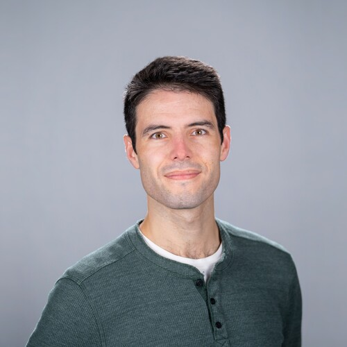

- Assistant Professor
- [EECS at UC Berkeley](https://eecs.berkeley.edu/)
- Soda Hall, 725
- [mwillsey@eecs.berkeley.edu](mailto:mwillsey@eecs.berkeley.edu)

<section markdown="1" id="intro">

I'm an Assistant Professor in
[EECS at UC Berkeley](https://eecs.berkeley.edu/).
My research aims to make program optimization
 more robust, powerful, and accessible.
Along the way, I use techniques from programming languages,
 databases, and systems.

Check out these pages for info on my current projects:

- The [egg](https://egraphs-good.github.io) project uses e-graphs to 
  build new kinds of program optimizers.
  - See also the GitHub pages for 
    [egg](https://github.com/egraphs-good/egg)
    and [egglog](https://github.com/egraphs-good/egglog).
- The [EGRAPHS Community](https://egraphs.org/), 
  a community for e-graphs researchers consisting of a forum, 
  a workshop, and a monthly seminary series.

**I am recruiting PhD students this year**

I am looking for students with strengths 
 in some subset of compilers, databases, e-graphs, SMT solvers, theorem proving, and logic programming.
You definitely don't have to have mastery of all those things, 
 but there's a lot of fun work to do in the intersection.

</section>

<section markdown="1" id="people">
## People

I'm fortunate to work with great collaborators and students, including:

-  (PhD student)
-  (PhD student)
-  (Undergrad)
-  (Postdoc)

</section>

<section markdown="1" id="news">

## News

- <time>2026.01</time>
  I co-organized a [Dagstuhl Seminar](https://www.dagstuhl.de/en/seminars/seminar-calendar/seminar-details/26022) on the use of e-graphs in compilation.
- <time>2025.02</time>
  Our [POPL 2021 paper](/papers/egg) on the egg project was selected as a
  [SIGPLAN Research Highlight](https://www.sigplan.org/Highlights/Papers/)!
- <time>2024.12</time>
  [EGRAPHS 2025](https://pldi25.sigplan.org/home/egraphs-2025),
  will take place at [PLDI 2025](https://pldi25.sigplan.org/) in Seoul!
- <time>2024.05</time>
  Our [SIGMOD paper](/papers/freejoin) unifying traditional hash joins 
  with worst-case optimal joins was selected as a SIGMOD Record Research Highlight.
- <time>2024.01</time>
  I've started as an Assistant Professor position at [EECS at UC Berkeley](https://eecs.berkeley.edu/)!
{: .time-list}

</section>

<section id="teaching">

<h2>Teaching</h2>

<ul class="time-list">

  <li> 
    <time>{{ course.when }}</time>
    
      <a href="{{ course.url }}">{{ course.number }}</a>: {{ course.title }}
    
      {{ course.number }}: {{ course.title }}
    
       {{ course.note }} 
  </li>

</ul>

</section>

<section id="papers">

<h2>Papers</h2>

<ul class="papers">

  
    
  

</ul>

</section>
